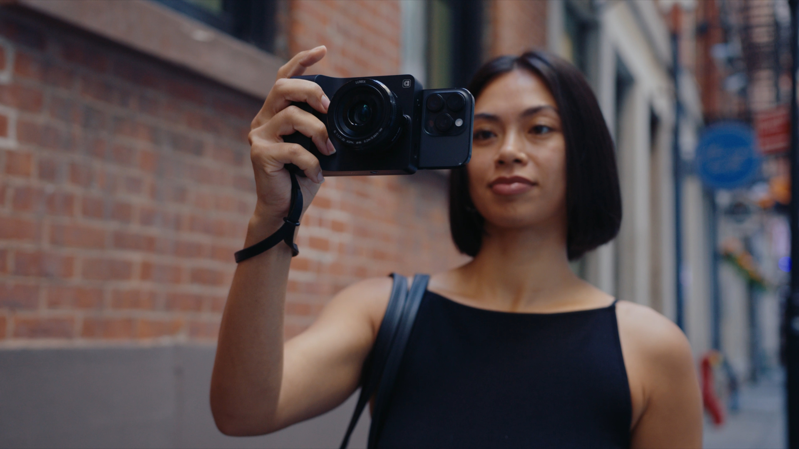

## Background
[Camera Intelligence](https://cameraintelligence.com/) is a London-based camera hardware and software company developing intelligent camera systems. By integrating AI models they are enabling on-device capabilities, editing and voice control with more planned for the future. The idea for the products came from the founder’s experience creating photo and video content for Sotheby’s Institute for Art. The 2nd generation of their product, Caira, has a Micro Four Thirds sensor and uses standard camera lenses.

:::{.column-page}
{fig-alt="A photograph of a woman in a white t-shirt holding Camera Intelligence's 'Caira' product with a wide-angle lens. She is looking at the camera back as if focusing on the photo or videography."}
:::

::: figure-caption
A woman holds Camera Intelligence’s 2nd generation Caira camera, copyright Camera Intelligence.
:::

## Application of AI 
Camera Intelligence uses a variety of AI models within their products. This includes Large Language Models (LLMs) for understanding of user input, agentic systems for controlling the camera, computational photography for more traditional control of photographic parameters, and cloud-hosted models for image and video generation.

**LLMs** The team have integrated an LLM that runs directly on the camera hardware, enabling users to interact with the device through natural language. For example “take a photo in five seconds”, iterating on an idea “that looks great, but could you add a little more contrast”, and complex requests “can you make it look like kodak vision”.

**Generative Editing** The product also integrates into cloud-based generative models to enable editing of images using Google’s Nano Banana - for example, removing unwanted elements from a scene using simple voice prompts.

**Agentic Workflows** Camera Intelligence looks to move beyond simple command and response to more complex capabilities. As Vishal explains:

“You might be able to push this edit button …it will remove filler words, it will add subtitles, and it will do a little bit of colour grading depending on your style. And in… 2 minutes … you’ll get a file back that’s…in a pretty good place.”

::: {.column-page}
::: {.pullquote-container}
::: {.grid .gap-6 .pb-3 .pt-4}
::: {.g-col-12 .g-col-sm-9}
::: {.pullquote}
“We’re looking to make it easier for people to express themselves, tell their stories. We are very conscious and aware of what we're doing…we’re not here to replace people.” 
:::
:::
::: {.g-col-12 .g-col-sm-3}
{fig-alt="Headshot of Vishal Kumar, Camera Intelligence's co-founder, holding one of their Caira units, pointing it at the camera."}

::: figure-caption
Vishal Kumar, co-founder of Camera Intelligence.
:::

:::
:::
:::
:::

## Applying the CoSTAR Foresight Lab AI roadmap
Our AI roadmap is organised around three strategic outcomes – frameworks, targeted support, and growth – and driven by nine recommendations that seek to align technological advancement with ethical responsibility and economic opportunity, ensuring long-term growth and success of the UK screen sector.

#### How this case study aligns with the roadmap

- **Carbon**
: Caira uses on-device models where practical, minimising the impact of relying on cloud computing for inference (understanding and generation).

- **Responsible AI**
: Camera Intelligence’s product came from friction that the founder experienced creating content using traditional tools - “The solution is to make capture devices and editing devices easier and to use agentic capabilities to offload the time-consuming editing so that the human, the spokesperson for the brand, for the story, for the vision, is kind of liberated from these kind of complicated editing tools”

- **Investment**
: Camera Intelligence’s products were initially supported by Kickstarter investors. They have recently secured £1.5million in seed funding (September 2025) from Betaworks, Next Wave, 7pc Ventures, and Digital Catapult.

- **Sector adaptation**
: The team’s main focus on the prosumer and independant creator market comes from a desire to enable creators to focus on the content and messaging for brands, individuals, or storytelling.

- **Public transparency**
: The product website has details about their integration of AI models and systems. The team have been vocal in their discussion of the challenges and opportunities AI technologies create (see below).

## Resources



::: {.grid .gap-3 .pb-3 .pt-4}
::: {.g-col-12 .g-col-sm-6}

[Find more case studies](/case-studies/index.qmd){.btn-action .btn .btn-lg .w-100 role="button"}

:::
::: {.g-col-12 .g-col-sm-6 .mb-2}

[Read the report](https://a.storyblok.com/f/313404/x/ac4c0235f7/ai-in-the-screen-sector.pdf){.btn-action .btn .btn-lg .w-100 role="button"}

::: 
::: 