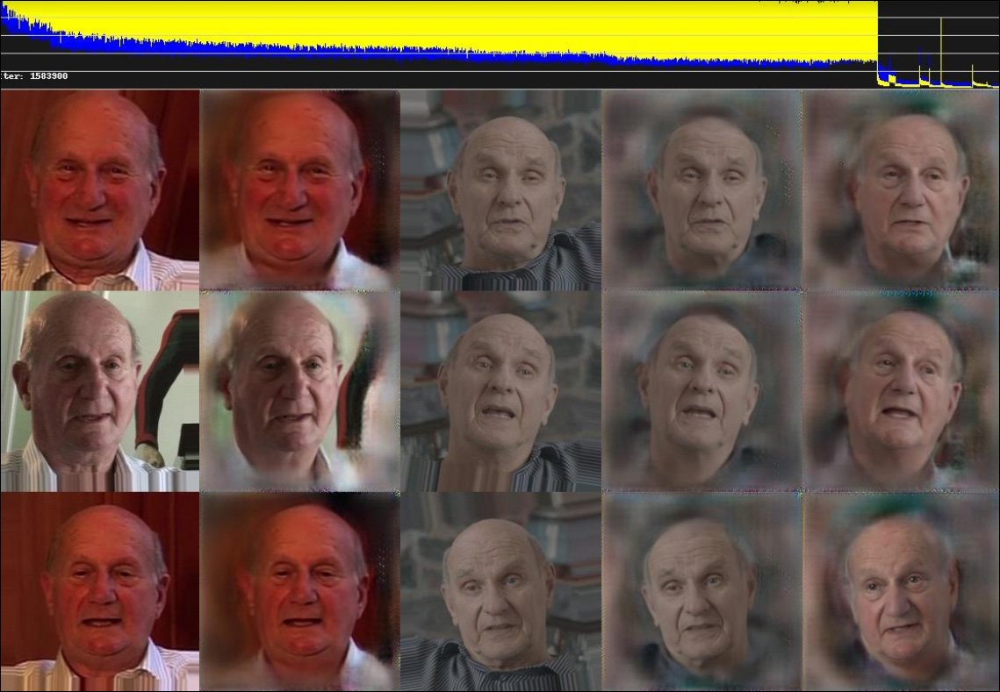
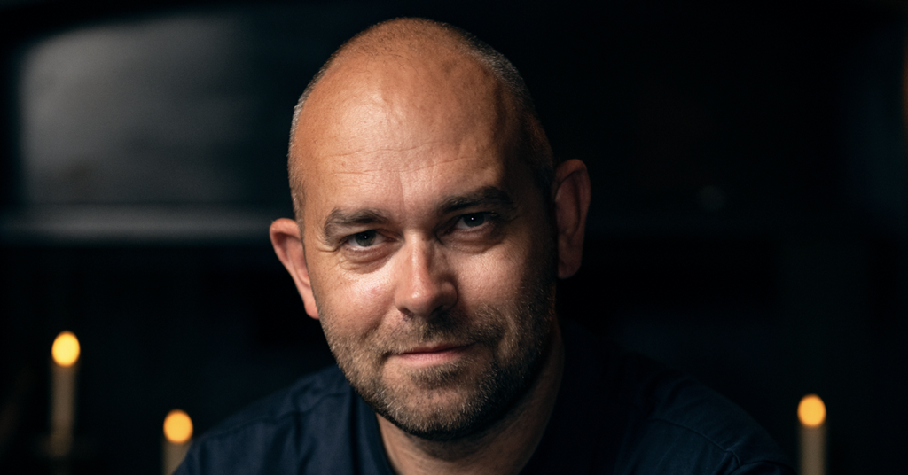

## Background
[Deep Fusion Films](https://www.deepfusionfilms.com/) are a Cardiff-based production company making premium documentary, factual series, and podcasts. The company's first production [_Gerry Anderson: A Life Uncharted_](https://anderson-entertainment.co.uk/content/gerry-anderson-a-life-uncharted/) used AI to explore the personal story of _Thunderbirds_ creator Gerry Anderson, whilst [_Virtually Parkinson_](https://www.broadcastnow.co.uk/industry-opinions/whats-the-point-of-virtually-parkinson/5199094.article) is a podcast series that aimed to recreate the experience of Michael Parkinson interviewing contemporary guests, using AI dialogue and voice synthesis.

:::{.column-body}
{fig-alt="A screenshot showing the 'DeepFake' process during the production of _Gerry Anderson: A Life Uncharted_."}
:::

::: figure-caption
A screenshot of the tools used to train and replace Gerry Anderson's face during the production of the show, courtesy of Deep Fusion Films.
:::

## Application of AI 

_Gerry Anderson: A Life Uncharted_ was the company's first production and came out of experimentation with emerging 'DeepFake' tools to overlay Gerry Anderson's visual appearance onto a body double and create new interview footage with the synthetic character. 

_Virtually Parkinson_ used synthetic audio generation to explore the idea of an AI system 'interviewing' new guests based on the style, tone, approach and generated voice of Sir Michael Parkinson.

Whilst these are the most high-profile examples of Deep Fusion's use of AI, more recently their focus has shifted to applying new technologies to address some of the fundamental economic challenges facing TV production. The company has been developing two systems to accelerate its own pre-production and planning around new ideas and projects:

- [Weavr](https://www.broadcastnow.co.uk/production-and-post/deep-fusion-and-topfoto-partner-to-produce-ai-powered-archive-docs/5209531.article) uses visual and metadata analysis to help producers identify what kind of stories could be told using available archive material. It generates potential concepts, three-act structures and illustrative scripts based on the creative briefs provided by producers. These scripts can then be mocked up with a synthetic voice platform, like [ElevenLabs](https://elevenlabs.io). 
- PaperCut is a tool that creates XML files based on available archive material and newly acquired interview and b-roll footage. 

Deep Fusion co-founder and CEO Ben Field is keen to emphasise that, in using these tools, productions are still being created by a regular production team. "It's just that they're working much, much quicker," says Fields. "And they're being able to iterate and be creative in a much more dynamic way."

::: {.column-body}
::: {.pullquote-container}
::: {.grid .gap-6 .pb-3 .pt-4}
::: {.g-col-12 .g-col-sm-9}
::: {.pullquote}
"We need to stop imagining that AI is putting people out of work. The industry is putting people out of work, and [we think] AI is creating opportunities to bring them back in."
:::
:::
::: {.g-col-12 .g-col-sm-3}
{fig-alt="Ben Field, co-founder and CEO, Deep Fusion Films"}

::: figure-caption
Ben Field, co-founder and CEO, Deep Fusion Films.
:::

:::
:::
:::
:::

## Applying the CoSTAR Foresight Lab AI roadmap
Our AI roadmap is organised around three strategic outcomes – frameworks, targeted support, and growth – and driven by nine recommendations that seek to align technological advancement with ethical responsibility and economic opportunity, ensuring long-term growth and success of the UK screen sector.

#### How this case study aligns with the roadmap

- **Responsible AI**
: Deep Fusion Films positions itself as an ethical creator and adopter of AI, and has been actively involved in shaping UK policy around AI use in the creative industries. The company has internal policies on copyright and training data.

- **Insight**
: Deep Fusion has been open about its use of AI and has shared insights into its processes and approaches, contributing to a broader understanding of the technology's potential and challenges. It also recently published its own white paper on the use of AI in the screen industries, which features an ethical AI checklist for producers (see [Resources](#resources) section).

- **Independent creation**
: Deep Fusion's story is part of an emerging theme. Creators are trying to use existing AI products and solutions but finding them wanting for creative tasks in the CoSTAR sectors. By building their own tooling and infrastructure, companies like Deep Fusion are enabling new workflows for themselves, and maintaining control over the use of the technology.

## Resources

- [*Deep Fusion Film's AI Whitepaper*](https://www.deepfusionfilms.com/s/Artificial-Intelligence-in-the-UK-Screen-Industries-A-Practical-White-Paper-November-25.pdf)

::: {.grid .gap-3 .pb-3 .pt-4}
::: {.g-col-12 .g-col-sm-6}

[Find more case studies](/case-studies/index.qmd){.btn-action .btn .btn-lg .w-100 role="button"}

:::
::: {.g-col-12 .g-col-sm-6 .mb-2}

[Read the report](https://a.storyblok.com/f/313404/x/ac4c0235f7/ai-in-the-screen-sector.pdf){.btn-action .btn .btn-lg .w-100 role="button"}

::: 
::: 