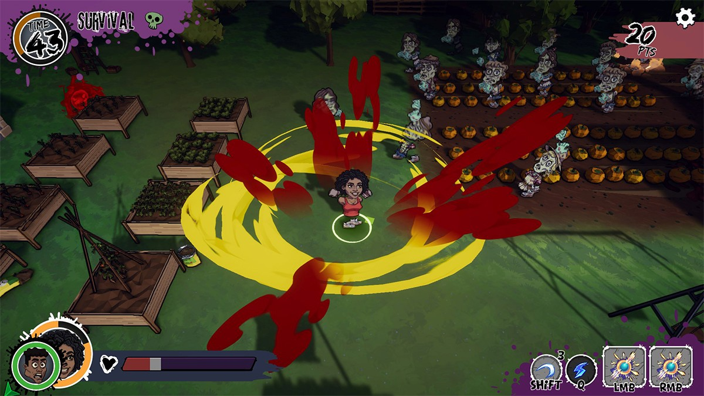
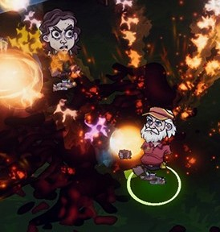

## Background
[10six Games](https://10sixgames.com/) is a UK-based independent game developer founded by Susan and Lee Cummings, industry veterans who have worked for major studios including 2K Games, 2K Sports and Rockstar and who previously set up Tiny Rebel Games in Cardiff. The first game in development at 10six is *YOU Vs. Zombies*, an action role-playing title that uses generative AI to shape character design, backstory, stats and special abilities. 

*YOU Vs. Zombies* is set in a world overrun by the undead, where only three wizards are left alive. The trio cast a spell to send one of their number back through time to inhabit the body of someone living at the start of the zombie outbreak. The spell mechanic is presented as an interactive dialogue between game and player. Players are asked to specify who they want to inhabit and to describe what this person looks like, where they live, what they do for a living, and their likes and dislikes. These inputs are then used as prompts for generative AI models to create a character model and a character sheet that lists key attributes, weapons and powers. Story beats, mission locations, dialogue and flavour text are also customised to the character design.

The game is currently in early alpha and is due to launch in early access in late summer 2026. It will also be playable as part of the Official Selection of the London Games Festival 2026.

:::{.column-body}
{fig-alt="Screenshot from YOU Vs. Zombies. In-game footage with a hand-drawn, comic-book art style. The playable female character is performing an area-of-effect move, indicated by jagged red and yellow energy rays radiating from her. To the right, a horde of zombies emerges from a pumpkin patch. Several wooden garden planters are scattered to the left. The UI shows a countdown timer at 43, a score of 20 PTS and a health bar at the bottom left."}
:::

::: figure-caption
Screenshot from *YOU Vs. Zombies*, copyright 10six Games.
:::

## Application of AI 
At 10six Games, the start point for *YOU Vs. Zombies* was the character creation process, guided by the belief that character design is a key draw for gamers, particularly fans of the role-playing genre. 

Underlying the game is the Infinity Platform, built on Google Cloud services. Prompts that are formulated as part of the “spellcasting” at the outset of the game are passed to Google’s Gemini model, which then creates prompts for models and tools further along the studio’s custom pipeline. 

For story creation, an LLM works within a narrative structure provided by the game’s story bible to shape various elements around the player’s input. If a character lives in Cardiff, say, Barry Island might be named as a mission location; those based in Hertfordshire might battle zombie hordes in Bishop’s Stortford instead.

To keep character designs consistent while customisable, 10six Games used [low-rank adaptation (LoRA)](https://www.ibm.com/think/topics/lora) to finetune a model on artwork created by the team’s artist, ensuring outputs adhere to the game's specific 2D comic art style.

::: {.column-body}
::: {.pullquote-container}
::: {.grid .gap-6 .pb-3 .pt-4}
::: {.g-col-12 .g-col-sm-9}
::: {.pullquote}
“This company was built on the question of, what happens when you take LLM outputs and use them as native inputs into a system? What happens when you can unlock on-demand creation of art assets? What sort of new gameplay does that create?”
:::
:::
::: {.g-col-12 .g-col-sm-3}
{fig-alt="Screenshot from YOU Vs. Zombies. In-game footage showing a bearded man in a cap blasting fireballs at a zombie."}

::: figure-caption
Quote from Lee Cummings, co-founder, 10six Games. Image shows screenshot from YOU Vs. Zombies, copyright 10six Games.
:::

:::
:::
:::
:::

## Applying the CoSTAR Foresight Lab AI roadmap
Our AI roadmap is organised around three strategic outcomes – frameworks, targeted support, and growth – and driven by nine recommendations that seek to align technological advancement with ethical responsibility and economic opportunity, ensuring long-term growth and success of the UK screen sector.

#### How this case study aligns with the roadmap
* **Responsible AI**  
  For *YOU Vs. Zombies*, 10six is blending human creativity with AI model capabilities. The studio’s creative team provides the gameplay, art design, and story systems, and generative AI models operate within these frameworks to customise game elements in response to player input.  
    
* **Insight**  
  In January 2026, at Pocket Gamer London Connects, Susan Cummings presented to industry on the architecture 10six has developed to enable player personalisation and the various safeguards it has put in place.

* **Independent creation**  
  *YOU Vs. Zombies* is an example of UK-based creators leveraging AI technologies to develop new storytelling modes and gameplay experiences.

## Resources
- [YOU vs. Zombies \- Roguelike Zombie Survival Game](https://10sixgames.com/)
- [YOU vs Zombies on Steam](https://store.steampowered.com/app/4224660/YOU_vs_Zombies/)

::: {.grid .gap-3 .pb-3 .pt-4}
::: {.g-col-12 .g-col-sm-6}

[Find more case studies](/case-studies/index.qmd){.btn-action .btn .btn-lg .w-100 role="button"}

:::
::: {.g-col-12 .g-col-sm-6 .mb-2}

[Read the report](https://a.storyblok.com/f/313404/x/ac4c0235f7/ai-in-the-screen-sector.pdf){.btn-action .btn .btn-lg .w-100 role="button"}

::: 
::: 
