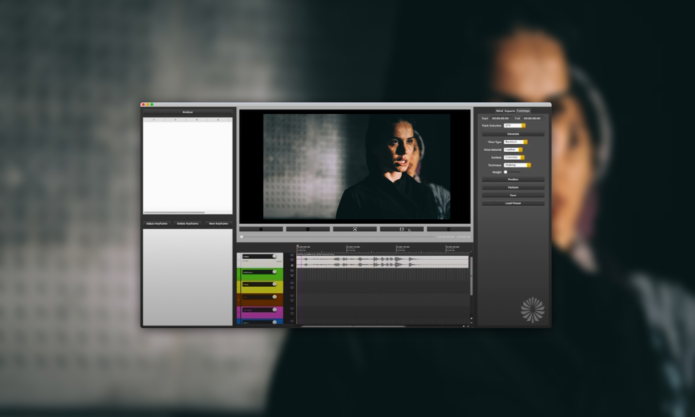

## Background
[Black Goblin](https://blackgoblinaudio.co.uk/) is an Edinburgh-based creative technology company started by two female founders.

The team started working on a product called Thol that would automate ‘spotting’ -- identifying where in a video timeline audio elements need to be added -- and generating, using AI, appropriate sound effects to be inserted into the timeline. The team is now initially building out the spotting functionality, based on user feedback and research.

“Sound design is a discipline that ... very much goes hand-in-hand with new novel technologies; how to use technology to enhance the creative side of work,” says Black Goblin co-founder Ana Betancourt.

:::{.column-body}
{fig-alt="A mockup of Thol’s user interface. The image shows a video timeline with timecodes and a list of sound effects to be added to the timeline."}
:::

::: figure-caption
A mockup of Thol’s user interface, copyright Black Goblin. The application is currently in beta testing.
:::

## Application of AI 
The original vision for Thol was to explore the automation of sound effects in a video timeline to create a rough first pass for sound editors. The company conducted observational research, sitting with approximately 10 sound designers over several months to watch them work. Betancourt describes the methodology: “We just observed ... without asking questions, except when we saw them struggle, you know, can you explain what you’re doing?”. The participants identified spotting and marking as a place where technology could be applied, without encroaching on their creativity and professional practice, and the Black Goblin team is prioritising this use case.

Thol’s functionality relies on a mixture of machine learning methods, including [vision-language models](https://huggingface.co/blog/vlms), a class of AI models that integrates understanding of both image and text, to extract timestamps of action-related events and sound sources from a video.

Whilst these types of models are trained on existing text, image and video data, Black Goblin are using them to guide an audio production session.

::: {.column-body}
::: {.pullquote-container}
::: {.grid .gap-6 .pb-3 .pt-4}
::: {.g-col-12 .g-col-sm-9}
::: {.pullquote}
“Success for us looks like a sound designer using this, and feeling that they were able to make more impact on their projects because of the time that they saved”
:::
:::
::: {.g-col-12 .g-col-sm-3}
{fig-alt="Black Goblin’s co-founder, Ana Betancourt"}

::: figure-caption
Ana Betancourt, co-founder of Black Goblin.
:::

:::
:::
:::
:::

## Applying the CoSTAR Foresight Lab AI roadmap
Our AI roadmap is organised around three strategic outcomes – frameworks, targeted support, and growth – and driven by nine recommendations that seek to align technological advancement with ethical responsibility and economic opportunity, ensuring long-term growth and success of the UK screen sector.

#### How this case study aligns with the roadmap

- **Responsible AI**
: Black Goblin’s focus changed from generating audio to marking up spotting sessions after engaging in user research. The users of their tool, currently in beta, are informed where in the pipeline AI models are being used.

- **Investment**
: The team have received funding and support from University of Edinburgh, MyWorld (UKRI), and CoSTAR. They are currently looking to raise a funding round.

## Resources



- [Black Goblin website](https://blackgoblinaudio.co.uk/)
- [Black Goblin contributed to *An Introduction to Responsible AI for SMEs* - via Coursera](https://www.coursera.org/learn/an-introduction-to-responsible-ai-for-smes)

::: {.grid .gap-3 .pb-3 .pt-4}
::: {.g-col-12 .g-col-sm-6}

[Find more case studies](/case-studies/index.qmd){.btn-action .btn .btn-lg .w-100 role="button"}

:::
::: {.g-col-12 .g-col-sm-6 .mb-2}

[Read the report](https://a.storyblok.com/f/313404/x/ac4c0235f7/ai-in-the-screen-sector.pdf){.btn-action .btn .btn-lg .w-100 role="button"}

::: 
::: 