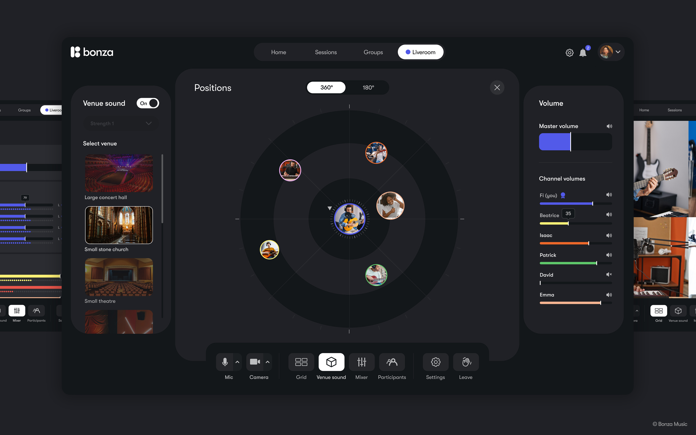

## Background
[Bonza](https://bonzamusic.com) is a UK-based music technology company developing Bonza, a software platform that enables musicians and performers to collaborate remotely in real-time. The product addresses latency, one of the most persistent technical problems in remote creative work. Standard video-conferencing tools such as Zoom or Teams introduce perceptible delays that make synchronised musical performance difficult, even a few hundred milliseconds of lag breaks the rhythmic lock that musicians depend on.

Bonza has been in evelopment for four years. The platform combines ultra-low latency audio and video transmission with immersive spatial audio, giving users a sense of physical presence with their collaborators. One of the main features is being able to change the acoustic environment that the collaboration is happening in.

:::{.column-body}
{fig-alt="Bonza screenshot TBC"}
:::

::: figure-caption
Screenshot of the Bonza platform, courtesy of Bonza.
:::

## Application of AI 
The most direct application of AI in Bonza’s platform relates to the acoustic environment. A distinctive feature of Bonza is its use of ‘digital acoustic twins’, detailed computational models of real physical spaces that, when applied within the platform, give users the sense of performing together in that shared acoustic environment. This could be a famous rehearsal room, the local church or a notable venue.

The underlying technical process is the capture of room impulse responses, measurements of how sound behaves within a specific space, from the resonance of a recording studio to the long reverb of a cathedral. The acoustic properties of a space are deeply connected to how music feels emotionally, and Bonza considers this a critical and underappreciated dimension of the collaborative experience.

The challenge with this capture process is that it is labour-intensive and requires expertise. A thorough acoustic survey of a single space typically requires between 18 and 72 individual physical measurements. To build a library of spaces rich enough to give Bonza users a meaningful choice of acoustic environments, Bonza needed a way to reduce the effort.

Through a project supported by BridgeAI and conducted in collaboration with the University of York AudioLab, Bonza trained an AI model to extrapolate an acoustic dataset from just two physical measurements in a space. Studies were then undertaken to ensure the perception of this extrapolated space was as good as a fully captured space.

::: {.column-page}
::: {.pullquote-container}
::: {.pullquote}
"We should be leveraging AI to improve our artistic creative endeavours, not to replace them. We believe in championing those that are creating works of music or theatre or works of art. Humans need to be at the heart of everything."
:::
:::

::: figure-caption
Fi Ryder, co-founder, Bonza.
:::

:::

## Applying the CoSTAR Foresight Lab AI roadmap
Our AI roadmap is organised around three strategic outcomes – frameworks, targeted support, and growth – and driven by nine recommendations that seek to align technological advancement with ethical responsibility and economic opportunity, ensuring long-term growth and success of the UK screen sector.

#### How this case study aligns with the roadmap

- **Responsible AI**
: Bonza’s explicit framing of AI as an assistive rather than generative technology reflects the responsible innovation principles at the heart of the roadmap. The company has chosen a narrow, well-defined application of AI in acoustic data extrapolation, where the benefits are clear and the risks are minimal, rather than incorporating more risky AI applications.

- **Investment**
: The BridgeAI programme and the University of York partnership provided the research infrastructure that made Bonza’s AI development possible. This illustrates how targeted public investment in AI R&D can enable smaller creative technology companies to solve hard technical problems that would otherwise be out of reach. The team have also benefitted from the use of CoSTAR LiveLab’s audio space within Production Park, near Wakefield.

- **Independant creation**
: Bonza is designed specifically to empower independent musicians, educators, and small performing arts groups to collaborate without being physically co-located. By removing the latency barrier that previously made real-time remote performance impractical, the platform opens up new possibilities for creative collaboration across geography, and reduces the economic and logistical costs of getting creative people in the same room.

- **Sector adaptation**
: Bonza’s work demonstrates how a combination of audio engineering innovation and targeted AI application can create new infrastructure for the creative industries. The platform has potential applications beyond music, including script read-throughs for theatre and animation, pointing to broader adaptations in how the performing arts sector might work in a hybrid world. 

## Resources
- [Bonza](https://bonzamusic.com)
- [BridgeAI](https://iuk-business-connect.org.uk/programme/bridgeai/)
- [Bonza / University of York - Academic paper](https://arxiv.org/abs/2510.04937)

::: {.grid .gap-3 .pb-3 .pt-4}
::: {.g-col-12 .g-col-sm-6}

[Find more case studies](/case-studies/index.qmd){.btn-action .btn .btn-lg .w-100 role="button"}

:::
::: {.g-col-12 .g-col-sm-6 .mb-2}

[Read the report](https://a.storyblok.com/f/313404/x/ac4c0235f7/ai-in-the-screen-sector.pdf){.btn-action .btn .btn-lg .w-100 role="button"}

::: 
::: 