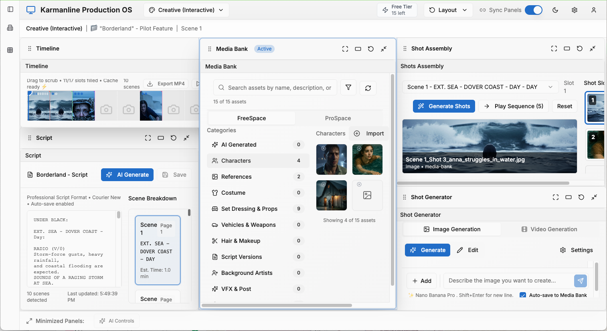

## Background
[Karmanline](https://www.karmanline.uk/) was founded in 2025 by Tim Carter, Paul Barnes, Chloe Chesterton and Simon Mirren. Half the team have a background in film and TV (Chesterton as an assistant director on feature films, and Mirren as a showrunner) and half in the technology industry. 

The company is setting out to build what Carter describes as an “operating system” for film and TV productions: “a mechanism for bringing together different tools and applying those to different workflows” to help turn creative ideas into operational and business plans. 

Generative AI tools allow productions to connect and coordinate the operational planning side with the creative side in new and interesting ways, says Carter. While developing a concept into a script, for example, a production team might also, in parallel, be developing early-stage visuals to feed into scheduling and planning decisions, including location scouting.  

:::{.column-body}
{fig-alt="A screenshot of the Karmanline platform. Panels, from left to right, show a script editing window, a media bank of character images, an AI 'shot generator', and shot assembly functionality."}
:::

::: figure-caption
Screenshot of the Karmanline platform, courtesy of Karmanline.
:::

## Application of AI 
Karmanline is not looking to build its own AI models but instead develop software that allows a variety of models and tools to be integrated into a unified platform for cross-department collaboration. “We want Karmanline to be the place where your producer, director, writer or showrunner goes to orchestrate all the jobs to be done across a production,” says Carter. 

The team is taking a modular approach to building out the platform, beginning with a pre-visualisation web app that takes a script and uses several generative models – including Marey from Moonvalley and Google Gemini – to visualise key elements and scenes. As part of its script workflow, the company will be looking to integrate with screenwriting software Final Draft, but also allowing connections with Google Docs, Word, and other tools. “We don’t want to be dictating what tools people have to use,” says Carter.  

Next, the team expects to add in an automation layer that will infer, from script and visuals, what the shooting schedule options might be, as well as accounting or financing options. 

::: {.column-page}
::: {.pullquote-container}
::: {.pullquote}
"The requirements for automation and for the connection of information from production scheduling and production management have existed for a long time. But the opportunity exists now because AI tools are changing the game. Language models provide a new way of interfacing with computers, so non-programmers can get computers to do much more for them than could be done in the past."
:::
:::

::: figure-caption
Tim Carter, co-founder, Karmanline.
:::

:::

## Applying the CoSTAR Foresight Lab AI roadmap
Our AI roadmap is organised around three strategic outcomes – frameworks, targeted support, and growth – and driven by nine recommendations that seek to align technological advancement with ethical responsibility and economic opportunity, ensuring long-term growth and success of the UK screen sector.

#### How this case study aligns with the roadmap

- **Responsible AI**
  : In building out its platform, Karmanline is looking to embed the concept of a “Free Space” and a “Pro Space”: the former for early-stage ideation, where choice of AI model may have least risk attached to it; the latter for when new creative assets and IP are being realised, governance and risk management processes kick in, and producers require a clean chain of title and verifiable audit trail.

- **Insight**
  : As part of its mapping of creative and AI tools available to film and TV productions, Karmanline has produced and published (under Creative Commons license) [a table of more than 300 products](https://www.karmanline.uk/production-software), describing the main use cases of each product, their input and output modes, and whether they train on user data. The CoSTAR Foresight Lab has also published its own framework of [advanced machine learning tools used in film production](https://smiling-maple-b00.notion.site/15ee496f0faa806ea9e8eb41c5cccc69?v=15ee496f0faa81a782c6000c883e1140), organised by production phase. 

- **Sector adaptation**
  : Carter sees the coordination of information and workflows across creative and business processes as “imperative” given budgetary pressures linked to cost inflation. “When you're producing a TV show or a movie," he says "there's a whole bunch of tasks across production, execution, finance, administration and marketing. Those tasks need to be done however you're producing the content. But the opportunity of AI tools is that those tasks can be coordinated.” 

## Resources
- [Karmanline](https://www.karmanline.uk/)
- [Production software table](https://www.karmanline.uk/production-software)
- [Advanced Machine Learning in Film Production](https://smiling-maple-b00.notion.site/15ee496f0faa806ea9e8eb41c5cccc69?v=15ee496f0faa81a782c6000c883e1140)

::: {.grid .gap-3 .pb-3 .pt-4}
::: {.g-col-12 .g-col-sm-6}

[Find more case studies](/case-studies/index.qmd){.btn-action .btn .btn-lg .w-100 role="button"}

:::
::: {.g-col-12 .g-col-sm-6 .mb-2}

[Read the report](https://a.storyblok.com/f/313404/x/ac4c0235f7/ai-in-the-screen-sector.pdf){.btn-action .btn .btn-lg .w-100 role="button"}

::: 
::: 