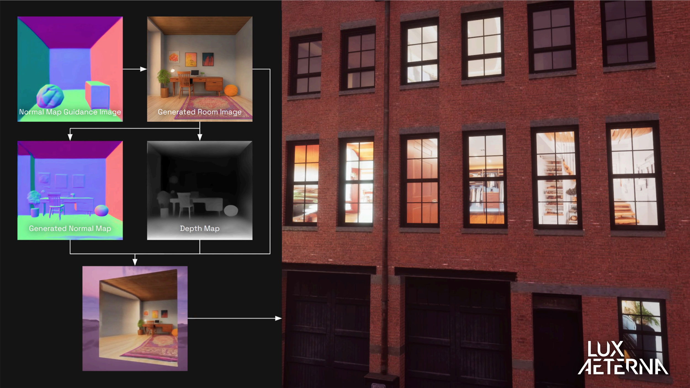

## Background

[Lux Aeterna](https://www.lavfx.com) is a BAFTA and Emmy award-winning independent visual effects (VFX) studio based in Bristol. They have worked on a range of high-profile projects, including _The Crown_, _Human_, and _The Solar System_. The company has a history of engaging with emerging technologies -- they are part of [MyWorld](https://www.myworld-creates.com), a UKRI-funded creative technology programme based around Bristol and Bath. 

## Application of AI 

Lux Aeterna’s work with AI began in 2023 through research and development (R&D) supported by the MyWorld programme. As part of this, the team explored generative AI tools in the context of VFX, experimenting with image generation models such as [Stable Diffusion](https://en.wikipedia.org/wiki/Stable_Diffusion) to power procedural generation of terrain or buildings, or as input into simulation of natural phenomena, such as storms or destruction events.

:::{.column-body}
{fig-alt="A screenshot of Lux Aeterna's exploration of integrating image diffusion models into the population of large scenes."}
:::

::: figure-caption
An example of the workflow exploration Lux Aeterna undertook as part of MyWorld, courtesy of Lux Aeterna.
:::

This early experimentation gave the team an opportunity to evaluate generative AI tools away from some of the challenges of client work. Rather than rushing to integrate AI into productions, the team used this period to build a realistic understanding of where generative tools could be genuinely useful, what practical shortcomings exist, and what legal and ethical questions remain unanswered. 

This caution is also commercially-minded. Lux Aeterna noted that many of its productions involve contracts that preclude uploading client material to cloud-based AI services, a constraint that limits the usefulness of many consumer-facing generative tools.

::: {.column-page}
::: {.pullquote-container}
::: {.grid .gap-6 .pb-3 .pt-4}
::: {.g-col-12 .g-col-sm-9}
::: {.pullquote}
"I put quite a bit of time into delving into sort of every aspect of it — from technical to creative to practical, and legal and ethical — and sort of come out the other side going: I still don’t know where things are going for us. I’m always an advocate for just taking a slowly, slowly approach, because you don’t necessarily want to be influenced by just this noise, this volume.”
:::
:::
::: {.g-col-12 .g-col-sm-3}
{fig-alt="James Pollock, creative technologist and VFX artist, Lux Aeterna"}

::: figure-caption
James Pollock, creative technologist and VFX artist, Lux Aeterna.
:::

:::
:::
:::
:::

As part of the MyWorld programme, Lux undertook production on their first short film, [*Reno*](https://www.lavfx.com/blog/reno), acting as a test bed for the new technologies they were exploring, including virtual production using LED walls, and realtime gaming engines. Part of that work will be published in the form of case studies, authored by senior academics in fields including cyber-law and copyright.

*Reno* also became a vehicle for exploring new capture techniques; Lux Aeterna's creative technologist James Pollock notes that [Gaussian splatting](https://huggingface.co/blog/gaussian-splatting) -- a relatively new approach to creating 3D scenes from photographs -- is of ongoing interest to the team. Whilst this approach doesn't specifically utilise neural networks in the same way many AI technologies do, it shares common algorithms and the reliance on heavyweight GPUs for training. 

## Applying the CoSTAR Foresight Lab AI roadmap
Our AI roadmap is organised around three strategic outcomes – frameworks, targeted support, and growth – and driven by nine recommendations that seek to align technological advancement with ethical responsibility and economic opportunity, ensuring long-term growth and success of the UK screen sector.

#### How this case study aligns with the roadmap

- **Responsible AI**
  : Lux Aeterna's decision to collaborate with legal experts, and to use those findings to inform their approach to generative AI in final productions, is an example of the informed, precautionary approach the roadmap advocates. The team have distinguished between what can be achieved in experimentation and what is appropriate for production.

- **Public transparency**
  : James Pollock’s ongoing tech blog (see [Resources](#resources) section) documents the studio’s explorations openly and critically, sharing both what works and what does not. The studio is also deliberate about how it describes its AI use publicly, wary of overclaiming in a space where reputational risks are real. 

- **Sector adaptation**
  : The team's adoption and exploration of new technologies, not just AI, shows how UK VFX studios can build repeatable, transferable workflows from them. Creating the space to explore and innovate outside of production constraints can position companies to offer clients genuinely novel solutions as techniques and technologies mature.

## Resources

- [Lux Aeterna's tech blog](https://www.lavfx.com/what-the-tech)
- [Lux Aeterna, MyWorld case study](https://www.digicatapult.org.uk/blogs/post/investigating-generative-ai-tools-for-vfx/)
- [CoSTAR National Lab's blog on Gaussian splatting R&D](https://costarnationallab.substack.com/p/the-promise-of-dynamic-gaussian-splatting)

::: {.grid .gap-3 .pb-3 .pt-4}
::: {.g-col-12 .g-col-sm-6}

[Find more case studies](/case-studies/index.qmd){.btn-action .btn .btn-lg .w-100 role="button"}

:::
::: {.g-col-12 .g-col-sm-6 .mb-2}

[Read the report](https://a.storyblok.com/f/313404/x/ac4c0235f7/ai-in-the-screen-sector.pdf){.btn-action .btn .btn-lg .w-100 role="button"}

::: 
::: 