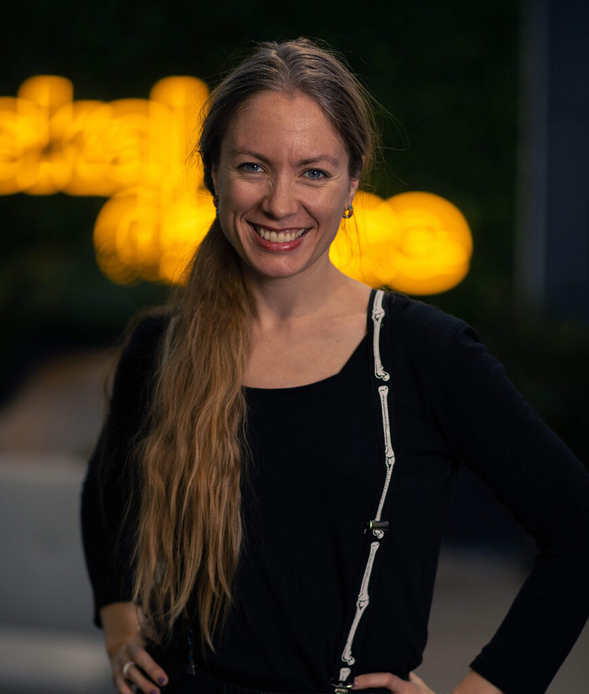

## Background
[Metrotone Media](https://metrotonemedia.com/) is a London-based film and television studio founded by TV producer and showrunner Katharina Gellein Viken and broadcaster and journalist Dr Charles Kriel. In December 2025, Metrotone launched [Screenburn](https://screenburn.app/), a content development tool to help creators structure story ideas around a variety of screen formats, including films, TV shows, and micro-dramas. 

Through a mix of questions and prompts, Screenburn guides users to develop ideas into key scenes within an overarching narrative. For example, for a feature film, users are first encouraged to describe the opening image or scene before introducing the story’s protagonist, their personality traits, strengths and flaws. Scenes can then be reordered or remixed to fit different formats, allowing for multiple adaptations of the same central idea.

Metrotone is looking to further develop Screenburn during its engagement with the [CoSTAR Evolve programme](https://www.costarnetwork.co.uk/calls/evolve/costar-evolve-companies), which is providing business growth support to 11 UK creative technology companies. 

::: {.column-body}
::: {.pullquote-container}
::: {.grid .gap-6 .pb-3 .pt-4}
::: {.g-col-12 .g-col-sm-9}
::: {.pullquote}
"When everybody started piling in and AI sort of levelled the playing field, we quickly realised that creating visuals would become easier. But creating a good story still wouldn’t be easy... Writing and content development hadn’t really had an upgrade."
:::
:::
::: {.g-col-12 .g-col-sm-3}
{fig-alt="Photo of Katharina Gellein Viken, co-founder, Metrotone Media."}

::: figure-caption
Katharina Gellein Viken, co-founder, Metrotone Media.
:::

:::
:::
:::
:::

## Application of AI 
The Screenburn user experience includes suggestions derived from large language models, although these suggestions are not based on the story or script in development. Instead, AI is used to explain core concepts – such as the role of a protagonist – and illustrate with examples from existing stories.

In this way, the user does not prompt the AI; the AI prompts the user. Viken says that while AI guidance features throughout the tool, it does not read the user’s story or script, and it doesn’t extract IP.

Metrotone has used Screenburn for its own content development. An early version helped develop the studio’s [Raynmaker](https://youtu.be/aJqdk67LYFA?si=iYVAAngENqlXi0Lv) story from book idea to script. Raynmaker is about an ex-marine living in hiding who creates a K-pop star as an online alter-ego. A 22-episode series is now in production, with generative AI tools being used to create both audio and visuals. Using Screenburn, the company has also developed micro-drama, feature film, novel and graphic novel versions of the Raynmaker story. 

Viken and Kriel used AI in writing the codebase for the Screenburn software. “We could never have done this without using AI to help code,” says Viken. “Instead of just the two of us, we would have needed a team of 10-15 people. But as with all AI, you have to have someone who’s experienced in the field looking over the outputs to recognise when it’s not giving you good stuff.”



## Applying the CoSTAR Foresight Lab AI roadmap
Our AI roadmap is organised around three strategic outcomes – frameworks, targeted support, and growth – and driven by nine recommendations that seek to align technological advancement with ethical responsibility and economic opportunity, ensuring long-term growth and success of the UK screen sector.

#### How this case study aligns with the roadmap

- **Rights**  
: Screenburn is designed so that AI is walled off from user content. Nor is AI used to create content directly, instead guiding users to write their own stories while using examples of character or plot developments drawn from existing sources.  
    
- **Skills**  
: Metrotone’s experience of using AI coding assistants to develop Screenburn from internal tool to product demonstrates a potential benefit of building AI skills within the screen sector: allowing creative professionals to design custom solutions for specific use cases within creative workflows.   
    
- **Independent creation**  
: The Screenburn approach positions AI as an assistant within a creative process that remains driven by human ideas and imagination. The role of AI is to augment the capabilities of a writer and allow them to sharpen and adapt their ideas to new formats.

## Resources
- [Metrotone Media](https://metrotonemedia.com/)
- [Screenburn](https://screenburn.app/)
- [Raynmaker pilot episode](https://youtu.be/aJqdk67LYFA?si=iYVAAngENqlXi0Lv)

::: {.grid .gap-3 .pb-3 .pt-4}
::: {.g-col-12 .g-col-sm-6}

[Find more case studies](/case-studies/index.qmd){.btn-action .btn .btn-lg .w-100 role="button"}

:::
::: {.g-col-12 .g-col-sm-6 .mb-2}

[Read the report](https://a.storyblok.com/f/313404/x/ac4c0235f7/ai-in-the-screen-sector.pdf){.btn-action .btn .btn-lg .w-100 role="button"}

::: 
::: 